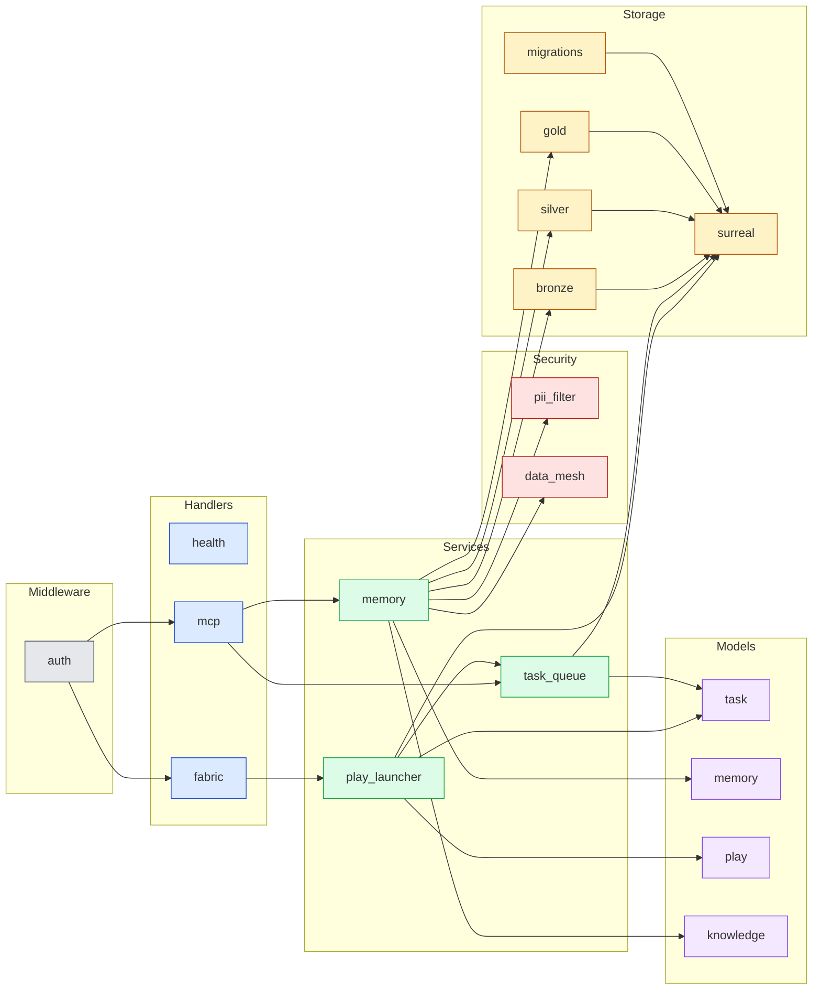

# WS1A: Per-Module Migration Assessment

Closes #52. Sibling to [SOURCE_INVENTORY_MATRIX](SOURCE_INVENTORY_MATRIX.md) — that doc lists every module in the upstream `lornu.ai/crates/data-fabric` and what it does. This doc answers the question the upstream inventory does not: **for each module, do we keep, adapt, replace, or drop?** Plus the three WS1A deliverables not covered elsewhere: D1 vs SurrealDB schema compatibility, runtime config extraction, and the full middleware inventory.

## Scope

WS1A is the per-module decision layer of WS1. Parent: [#42 WS1: Source Extraction](https://github.com/stevedores-org/data-fabric/issues/42) (closed). Source crate: `lornu.ai/crates/data-fabric`. Target: this repo (Cloudflare Workers Rust + D1 + Durable Objects + R2 + Vectorize + KV + Queues).

The four missing deliverables this doc addresses:

1. [Service boundary dependency graph](#1-service-boundary-dependency-graph) — explicit handlers → services → storage → models edges, not prose.
2. [Per-module migration assessment](#2-per-module-migration-assessment) — every upstream module classified Keep / Adapt / Replace / Drop with rationale.
3. [D1 vs SurrealDB schema compatibility](#3-d1-vs-surrealdb-schema-compatibility) — per-table mapping and the migration gaps.
4. [Runtime config inventory](#4-runtime-config-inventory) — env bindings, feature flags, secret references.
5. [Full middleware inventory](#5-full-middleware-inventory) — auth, logging, error handling, rate limiting, observability.

## 1) Service boundary dependency graph

Direction of arrows = direction of **calls** (caller → callee). Models and storage have no outgoing arrows in this graph because they are terminal data shapes / persistence sinks.

**Key shape observations** that drive the migration decisions in §2:

- All persistence flows funnel through `storage/surreal.rs`. Replacing SurrealDB with D1 is therefore a single-seam swap behind a repository trait, not a cross-cutting rewrite.
- `handlers/*` only depend on `services/*` and `middleware/auth` — they never reach into storage directly. The handler layer is portable verbatim to Workers' `Request → Response` shape.
- `services/memory` is the only service that fans out to security primitives. PII + DataMesh do not need to be wired anywhere else.
- Models are read by every service but written by no one — they are pure data shapes and migrate as types regardless of storage backend.

## 2) Per-module migration assessment

Legend:
- **Keep**: lift-and-shift; no semantic change.
- **Adapt**: same intent, requires changes for the Workers + D1 runtime.
- **Replace**: discard the implementation but preserve the contract.
- **Drop**: do not port; out of scope for this repo.

Status against current `src/` is checked against this branch's HEAD (`develop` at the time of writing).

| Upstream module | Decision | Current state in this repo | Rationale |
|---|---|---|---|
| `lib.rs` | Adapt | `src/lib.rs` (Workers `fetch` entrypoint) | Module wiring stays; the binary surface changes from axum router to Workers `event_handler`. |
| `main.rs` | Drop | n/a (Workers has no main) | Workers worker has no `fn main`; bootstrap moves into `fetch`/`scheduled` handlers. |
| `config.rs` | Adapt | partial: `APP_ENV` read inline in `lib.rs` | See §4 — config should be centralized as a typed bag derived from `Env` bindings, not ad-hoc `env.var()` calls scattered across handlers. |
| `error.rs` | Adapt | `src/errors.rs` | Same intent (typed error → HTTP response). Adapt because Workers `Response` builder differs from axum's `IntoResponse`. |
| `state.rs` | Adapt | partial: bindings resolved per-request from `Env` | On Workers each request gets its own `Env`; no long-lived `AppState` Arc. Adaptation: provide a request-scoped "context" that materializes service handles from `Env`. |
| `handlers/health.rs` | Adapt | inlined in `src/lib.rs` (GET `/health`) | Already adapted in this repo; keep as-is, but extract into `handlers/health.rs` for parity once handler count justifies a module split. |
| `handlers/fabric.rs` | Adapt | partial: play launch wired in `src/lib.rs` + `src/play_do.rs` | Endpoint contracts (`POST /v1/plays`, `GET /v1/plays/:run_id`) map 1-1; routing is currently inline rather than in `handlers/fabric.rs`. |
| `handlers/mcp.rs` | Adapt | partial: `GET /mcp/task/next` + `POST /mcp/response` exist | MCP surface is implemented but contracts need parity validation against the upstream — see [CAPABILITY_GAP_MAP P1 item 1](CAPABILITY_GAP_MAP.md). |
| `services/play_launcher.rs` | Adapt | partial: `src/play_do.rs` (PlayManager DO from PR #122) | The DO model differs from the upstream service pattern. Decompose-into-task-graph logic carries over; persistence layer changes (DO SQLite + D1 instead of Surreal). |
| `services/task_queue.rs` | Adapt | partial: `src/task_do.rs` + `src/db.rs` task tables | Queue/lease/retry semantics are the contract; the implementation uses a Durable Object (`TaskLeaseManager`) instead of in-memory `DashMap`+`BinaryHeap`. |
| `services/memory.rs` | Adapt | partial: `src/storage.rs` + `src/vector_index.rs` + `src/models/memory.rs` | Memory write path exists at the storage layer with a single-tier `memory` table plus `memory_index` for retrieval. The upstream Bronze/Silver/Gold tiering for memory was **not adopted** for this repo — see the `storage/{bronze,silver,gold}` rows below. |
| `storage/surreal.rs` | **Replace** | `src/db.rs` (D1 wrapper) | Storage backend swap — see §3 for the schema-level compatibility check. |
| `storage/migrations.rs` | Replace | `migrations/*.sql` (13 D1 migrations) | D1 uses ordered numbered SQL files; preserve the migration *concept*, not the implementation. |
| `storage/bronze.rs` | Drop for memory; **kept for events** | `events_bronze` table (migration `0002_m1_m3_agent_infra.sql`) | This repo deliberately chose a single-tier memory model (single `memory` table + `memory_index`). The Bronze/Silver/Gold *concept* is preserved but applied to **events / provenance** (`events_bronze`, `events_silver` in migration `0003_ws3_provenance.sql`), not memory. |
| `storage/silver.rs` | Drop for memory; **kept for events** | `events_silver` table (migration `0003_ws3_provenance.sql`) | Same deliberate scope shift: BSG tiering carries into the events domain, not memory. The PII-redaction gate (CAPABILITY_GAP_MAP `P0-2`) still applies wherever sensitive content is persisted, but binds to write-path middleware rather than a per-tier table. |
| `storage/gold.rs` | Drop for memory | n/a — no `memory_gold` analog | The curated-tier query surface is collapsed into `memory_retrieval_queries` + `memory_retrieval_feedback` plus `Vectorize` semantic ranking. Tag search lands on indexed D1 columns. |
| `models/task.rs` | Keep | `src/models/entities.rs` + `src/models/orchestration.rs` (WS2 schema present) | Type definitions port as-is via serde; field names already aligned to the WS2 entity model. |
| `models/memory.rs` | Adapt | **ported** — `src/models/memory.rs` (`MemoryKind`, `UpsertMemoryItemRequest`, `RetrieveMemoryRequest`, `MemoryItemCreated`) | Already in tree but with an adapted shape: `MemoryKind` enum (`Checkpoint`/`Artifact`/`Decision`/`Context`/`RunSummary`) replaces the upstream Bronze/Silver/Gold layer enum, matching the single-tier storage decision above. |
| `models/play.rs` | Keep | `src/models/plays.rs` | Already ported in PR #122. Keep parity by adding a fitness test against the upstream schema. |
| `models/knowledge.rs` | Adapt | not yet ported | Domain shape will likely need pruning to match WS2 `Artifact` and `ToolCall` rather than re-introducing a parallel knowledge namespace. |
| `security/pii_filter.rs` | **Replace** | not yet ported | Replace the regex-based scanner with a more robust pipeline at the Worker edge (regex baseline plus future Workers AI classifier). Contract = `(value) → (redacted_value, findings)` stays the same. |
| `security/data_mesh.rs` | Adapt | partial: `src/policy.rs`, `src/tenant_security.rs` | Policy decision shape exists; runtime authorization engine (deny-by-default, layer/key scoping) is not yet built — CAPABILITY_GAP_MAP `P0-1`. |
| `middleware/auth.rs` | Adapt | partial: `src/lib.rs:102` delegates to `tenant::authorize(&tenant_ctx, req.method(), &path)` | This repo went past the upstream's bearer-token primitive to a tenant-scoped policy check. The constant-time-compare primitive may not need to carry over; the tenant authorization path is the new contract. |

**Summary**: 4 Replace decisions (`main.rs` (Drop), `storage/surreal`, `storage/migrations`, `security/pii_filter`), 3 explicit Drop-for-memory rows on the Bronze/Silver/Gold storage modules (with the BSG concept deliberately retargeted at the events domain), 15 Adapt, 2 Keep (pure data types: `models/task`, `models/play`). The non-trivial finding here is **deliberate non-adoption** of the upstream BSG memory tiering — every other upstream module either ports across the SurrealDB→D1 / axum→Workers seam or has an explicit non-adoption rationale.

## 3) D1 vs SurrealDB schema compatibility

Upstream uses SurrealDB (document + graph). This repo uses D1 (SQLite). The two are not naively swappable; this section calls out the per-table impact.

| Upstream artifact | SurrealDB shape | Target D1 mapping | Compatibility | Action |
|---|---|---|---|---|
| `task` records | document; `RecordId` PKs, array fields for tags, nested object for `response`/`error` | `tasks` table (migration `0002`), TEXT for tags (JSON), separate `task_events` for state transitions | **Partial** — `RecordId` → TEXT id, nested objects → JSON columns | Adapt: add a repository abstraction that hides the shape; provide compatibility shims for legacy `tags` array reads |
| `play` records | document; `tasks[]` inline array, `params` jsonb | `play_definitions` (`0012`) + `play_runs` + join table to `tasks` | **Lossy** — D1 normalizes; need a join query to reconstitute the inline array | Adapt: keep the API response shape (`{ tasks: [...] }`) by joining on read; document the difference in the OpenAPI spec |
| `memory_bronze` / `memory_silver` / `memory_gold` | three tables in one Surreal namespace | **not ported as-is** — replaced by single `memory` table (`0004_ws5_memory.sql`) + `memory_index` / `memory_retrieval_queries` / `memory_retrieval_feedback` (`0003_ws5_memory_retrieval.sql`) | **Drop** for memory — the BSG concept survives in the *events* domain only (`events_bronze` in `0002_m1_m3_agent_infra.sql`, `events_silver` in `0003_ws3_provenance.sql`) | Drop for memory; document the single-tier decision so future contributors don't re-introduce BSG memory tables by reflex |
| `agent_permissions` | record per `(agent_id, layer, key_prefix)` | proposed `agent_policies` table | **New** — not yet in this repo | Build: matches `R2` in [MIGRATION_RISK_REGISTER](MIGRATION_RISK_REGISTER.md) |
| Surreal graph relations (e.g. `task -> belongs_to -> play`) | first-class edge records | foreign keys + join tables | **Lossy** — no transitive query | Adapt: every graph traversal needs an explicit recursive CTE or a flattened materialized table |
| Surreal LIVE queries (push subscriptions) | server-side change streams | no D1 equivalent | **Drop** — replace with Queues/DO storage events | Replace: any caller relying on LIVE migrates to a polling endpoint or queue-driven event consumer |
| Embedded `chrono::DateTime` fields | stored as Surreal datetime | TEXT (ISO 8601) in D1 | **Compatible** with serializer change | Keep: confirm `time` / `chrono` serde features emit ISO 8601 strings |
| `serde_json::Value` blob columns | native object | TEXT JSON column | **Compatible** | Keep: D1 has no JSON type; reads parse on demand |
| Migration files (`storage/migrations.rs`) | imperative Rust calling Surreal DDL | numbered `migrations/00NN_*.sql` consumed by Wrangler | **Incompatible** by shape, compatible by concept | Replace: ordered SQL files; the *concept* of migrations carries |

**WS2 entity alignment check** (the acceptance bar from issue #52):

| WS2 entity | Upstream source of data | This repo's D1 table(s) | Aligned? |
|---|---|---|---|
| `Run` | upstream `play` runtime instance | `runs` (`0001_ws2_domain_model.sql`) + `tasks.run_id` FK | ✅ yes |
| `Task` | upstream `task` | `tasks` (`0001`) | ✅ yes |
| `Plan` | upstream `play` definition | `plans` (`0001`) + `play_definitions` (`0012`) | ✅ yes |
| `ToolCall` | upstream MCP dispatcher events | `tool_calls` (`0001`, FKs to `runs.id` + `tasks.id`) | ✅ yes |
| `Artifact` | upstream knowledge/memory entries | `artifacts` (`0001`) + `memory` (`0004`) for in-flight context | ✅ yes |
| `PolicyDecision` | upstream `data_mesh.rs` decisions | `policy_decisions` (`0001`) + `policy_rules` / `policy_escalations` / `policy_rate_limit_counters` (`0004`) | ⚠ partial — decision *record* and rule storage exist; runtime enforcement engine does not (CAPABILITY_GAP_MAP `P0-1`) |
| `Release` | upstream play terminal state | `releases` (`0001`) | ✅ yes |

## 4) Runtime config inventory

Sources scanned: `lornu.ai/crates/data-fabric/src/config.rs` (per the upstream inventory) and this repo's current `wrangler.toml` plus `src/lib.rs` env reads.

### Environment variables (upstream `config.rs`)

| Variable | Purpose | Carried into this repo? | Where |
|---|---|---|---|
| `SURREAL_URL` | DB URL | **Dropped** (D1 binding `DB` instead) | `wrangler.toml` `[[d1_databases]]` |
| `SURREAL_NS` / `SURREAL_DB` | DB namespace + name | **Dropped** | n/a |
| `SURREAL_USER` / `SURREAL_PASS` | DB auth | **Dropped** (D1 uses Worker binding identity) | n/a |
| `BIND_ADDR` | HTTP bind address | **Dropped** (Workers manages routing) | `wrangler.toml` `routes` |
| `LOG_LEVEL` | tracing filter | **Adapt** — currently no tracing wired | Add `[vars] LOG_LEVEL` |
| `BEARER_TOKEN` / shared secret | auth | **Adapt** — should be a secret, not a var | `wrangler secret put AUTH_TOKEN` (not yet wired) |
| `APP_ENV` | env label (dev/staging/prod) | ✅ in repo | `wrangler.toml` `[vars]` per environment |
| n/a (upstream had none) | service identity | added in this repo | `SERVICE_NAME` in `[vars]` |
| n/a | MOM integration URL | added in this repo | `MOM_ENDPOINT` per environment |

### Cloudflare bindings (target-only, no upstream equivalent)

These are the new attack surface and configuration sources introduced by the Workers runtime. They must exist in the account before deploy succeeds — see the [WS1A appendix on Vectorize provisioning](#appendix-account-side-resources-that-must-exist-before-deploy) below.

| Binding | Type | Notes |
|---|---|---|
| `DB` | D1 database | `data-fabric` |
| `ARTIFACTS` | R2 bucket | `data-fabric-artifacts` |
| `POLICY_KV` | KV namespace | hot path for policy lookups; not yet implemented |
| `EVENTS` | Queue producer + consumer | provenance event bus |
| `SEMANTIC_INDEX` | Vectorize index | BGE-base, 768-dim, cosine |
| `AI` | Workers AI binding | for embeddings via `@cf/baai/bge-base-en-v1.5` |
| `TASK_LEASE_MANAGER` / `THREAD_MANAGER` / `PLAY_MANAGER` | Durable Objects | one per coordination concern |

### Feature flags

Upstream had no explicit feature-flag plumbing. This repo currently has none either. **Recommendation** for follow-up: gate each new capability behind a `[vars]`-level boolean or a `POLICY_KV` lookup so partial-rollout regressions are caught at the env boundary (matches `R10` in [MIGRATION_RISK_REGISTER](MIGRATION_RISK_REGISTER.md)).

### Secrets

| Secret | Required | Provisioning |
|---|---|---|
| `AUTH_TOKEN` | ✅ (gates non-public routes) | `wrangler secret put AUTH_TOKEN --env <env>` — **not yet wired in any environment** |
| Cloudflare API token (for Vectorize / R2 admin) | only for ops, not runtime | personal token, never put in the worker |

### Appendix: account-side resources that must exist before deploy

Resources that wrangler will not auto-create at deploy and that, if missing, surface as `code: 10159` or similar `Cloudflare API errors during versions upload`. (Live example: PR #122's failing Workers Build was caused by `SEMANTIC_INDEX` referencing a Vectorize index that did not exist in the account.)

| Resource | One-shot create command |
|---|---|
| D1 database | `wrangler d1 create data-fabric` (already provisioned: id `6afcdc53-...`) |
| R2 bucket | `wrangler r2 bucket create data-fabric-artifacts` |
| KV namespace | `wrangler kv namespace create POLICY_KV` |
| Queue | `wrangler queues create data-fabric-events` |
| Vectorize index | `wrangler vectorize create data-fabric-semantic-index --dimensions=768 --metric=cosine` |
| Per-env Vectorize indexes | repeat with `-dev`, `-staging`, `-prod` suffixes |

## 5) Full middleware inventory

The upstream `middleware/` directory contains only `auth.rs`. The four other middleware concerns called out in WS1A's acceptance criteria are implemented elsewhere in the upstream (or missing entirely). This is the complete picture:

| Concern | Upstream location | This-repo location / status | Migration decision |
|---|---|---|---|
| **Authentication** | `middleware/auth.rs` (Bearer token, constant-time compare) | `src/lib.rs:102` delegates each request to `tenant::authorize(&tenant_ctx, req.method(), &path)` — a tenant-scoped policy check, not a bearer compare | Adapt — the tenant authorization path is the new contract; the upstream constant-time bearer primitive may not carry over since the policy check supersedes it. Confirm the tenant authorization path itself does constant-time comparisons where it compares token-shaped values. |
| **Logging / tracing** | `tracing` initialized in `main.rs` via `LOG_LEVEL` env | **Missing** in this repo | Build — add `tracing-subscriber` with a Workers-compatible writer; emit JSON to `console.log` so Workers Logs picks it up |
| **Error handling** | `error.rs` `IntoResponse` impl | `src/errors.rs` exists but not consistently used by handlers | Adapt — every handler should `return ApiError::*.into_response()` instead of building `Response::error()` ad-hoc |
| **Rate limiting** | not present upstream | not present | Build — Cloudflare Rate Limiting Rules at the zone level for coarse limits, plus per-tenant token bucket in `POLICY_KV` for fine-grained limits |
| **Observability (metrics)** | upstream had no first-class metrics surface | partial: `src/metrics.rs` exists, plus `GET /v1/metrics/pilot` (added in PR #112) | Keep + extend — wire to Workers Analytics Engine for sampled time-series |
| **Tenant isolation** | upstream had no multi-tenancy | `src/tenant.rs`, `src/tenant_security.rs`, migration `0005_ws8_multi_tenant.sql` | Already implemented in this repo — no upstream pattern to extract |
| **Idempotency** | not addressed upstream | not present | Build (future) — required for safe retries of mutating MCP endpoints |
| **CORS** | not addressed upstream | not present | Build — needed before any browser UI calls the worker |

**Summary**: of the 8 middleware concerns relevant to a production Worker, 1 ports cleanly (auth), 2 partially exist already (errors, metrics, tenant), and 5 require new design (logging, rate limiting, idempotency, CORS, plus end-to-end observability hookup). The upstream `middleware/` directory is not the right source of truth for any of these except `auth.rs`.

## Acceptance-criteria check

Mapped against [issue #52](https://github.com/stevedores-org/data-fabric/issues/52):

- [x] Every module in `crates/data-fabric` is inventoried with purpose, inputs, outputs, dependencies — see [SOURCE_INVENTORY_MATRIX §1](SOURCE_INVENTORY_MATRIX.md#1-core-crate-module-inventory-complete).
- [x] Migration decisions are documented with explicit rationale — §2 above, 24 modules classified Keep / Adapt / Replace / Drop (with explicit Drop-for-memory decisions on the BSG storage modules).
- [x] Extracted patterns validate against WS2 entities — §3 WS2 alignment table; all seven canonical entities (`Run`, `Task`, `Plan`, `ToolCall`, `Artifact`, `PolicyDecision`, `Release`) have backing D1 tables in migration `0001_ws2_domain_model.sql` plus follow-ups, with `PolicyDecision` flagged as partial (storage exists, runtime enforcement engine pending).
- [x] No blind copy-paste — every extracted pattern has a documented fitness assessment, and the BSG memory-tier decision is an explicit non-adoption with a rationale rather than a silent skip.

## Cross-references

- [README](README.md) — WS1 deliverable index.
- [SOURCE_INVENTORY_MATRIX](SOURCE_INVENTORY_MATRIX.md) — upstream module list (the table this doc references throughout).
- [CAPABILITY_GAP_MAP](CAPABILITY_GAP_MAP.md) — priority scoring of *what's missing*.
- [MIGRATION_RISK_REGISTER](MIGRATION_RISK_REGISTER.md) — risk severity / likelihood / mitigation.
- [ARCHITECTURE_SEED](ARCHITECTURE_SEED.md) — five-boundary seed (A-E) validated against WS2 entities.
